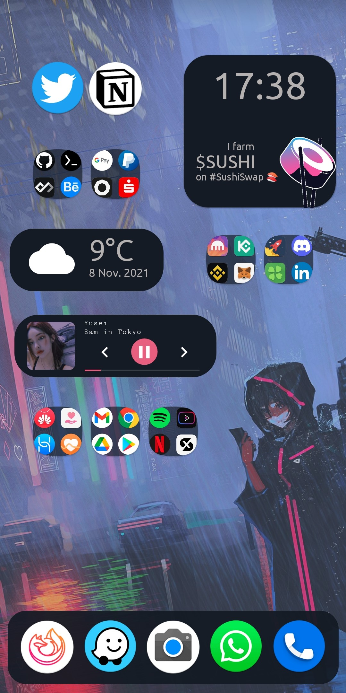

# Android Homescreen [Ricing](https://wiki.installgentoo.com/wiki/Android_ricing) 📱🍙 [MIRAI-未来]

a small collection of KWGT Widgets I did for my Huawei Mate 20 Pro `LYA-29`

## Screenshots

Music_Player.kwgt, Neofetch.kwgt           |  Sushi_Clock.kwgt, Weather.kwgt
:-------------------------:|:-------------------------:
  |  

## How to use it?

you can import the `.kwgt` files with the [Kustom KWGT App](https://play.google.com/store/apps/details?id=org.kustom.widget)\.

---

### todo

- [ ] fetch termux output from bash\.
- [ ] add current $SUSHI price and SushiBar APY  <-- [Sushiswap subgraph?](https://github.com/sushiswap/sushiswap-subgraph)
- [ ] toggle light/dark mode\.
